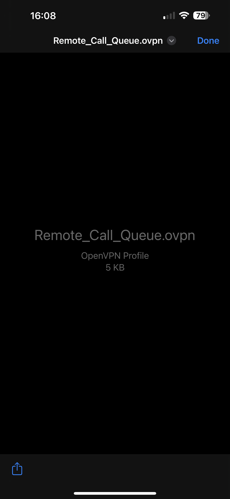

# RemoteCallQueue
How to setup remote call queue for on-premise phones.

---
## Install Required Applications 

### Begin by installing **OpenVPN Connect** from the app store. 
  

### Next install **FracTELfone** from the app store. 
  

---
## Using the *OpenVPN Connect* Application 

### After recieving the `.ovpn` file click on the file attachment. 
  

### You will need to click on the square with the up arrow icon to bring up the import options. 
  

### Select the `OpenVPN` icon to import the file into your OpenVPN Connect application. 
  

### Upon clicking that the OpenVPN Connect application will open, click **ADD** located under the profile name. 
  

### After clicking **ADD** you will be brought to a screen where you click **CONNECT**. 
  

### After clicking **CONNECT** you should see the following which indicates a successful connection. 
  

---
## Using the *FracTELfone* Application 

### Click on the FracTELfone application from your home screen 
### Next log in with the provided username and password. 

### Then navigate to the keypad and **dial 333** to enter the queue. 
### To exit the queue at any time perform the 2 previous steps *(navigate to fracTELfone keypad -> dial 333)*  

  
